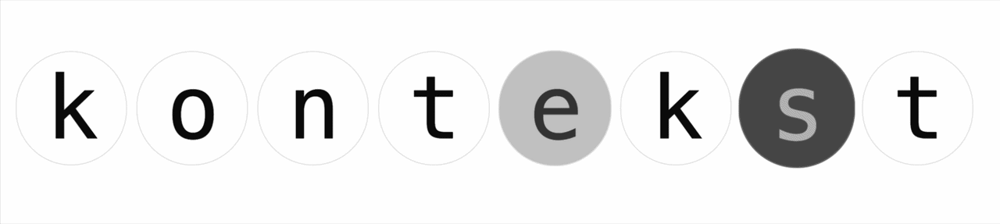

# kontekst



OpenRouter wrapper with minimal UI and local Context Management with utility keyboard shortcuts. Chat with any LLM, at API cost, without the noise. Includes a parallel **speech mode** for OpenRouter's TTS models and optional **web search** skill (Brave Search).

## Getting started

Requires [Node](https://nodejs.org/en/download) 20+.

```sh
npx kontekst
```

That's it. The app fetches itself, starts a local server on `http://localhost:8080`, and opens it in your browser. Data is stored in `~/.kontekst` (override with the `KONTEKST_FOLDER` env var).

To pick a different port:

```sh
PORT=9000 npx kontekst
```

## Storage

The backend persists all state as JSON files inside `KONTEKST_FOLDER` (default `~/.kontekst`).

- `keys.json` — OpenRouter API keys. Written with mode `0600` (owner read/write only). Manage them from the wallet menu in the UI; chat is disabled until at least one key is added.
- `brave-keys.json` — Brave Search API keys, also `0600`. Optional; required only if you want web search.
- `web-search-pref.json` — persisted state of the web-search toggle.
- `konteksts.json` — named LLM contexts (system prompts).
- `conversations.json` — full chat history per conversation, including the resolved kontekst, model, messages.
- `speech-clips.json` + `speech-audio/<id>.{mp3,pcm}` — TTS clip metadata and the raw audio bytes for each generation.
- `voice-prefs.json` — per-(model, voice) friendly names, keyboard shortcuts, and the default voice for each TTS model.

## Development

Clone the repo and run the dev servers (Vite + Nest watch + dtos watch):

```sh
npm install
npm run start
```

Layout:

- `apps/be` — NestJS backend
- `apps/ui` — Vite + TanStack Start frontend (SPA mode in production)
- `dtos` — shared Zod schemas

To test the production build locally:

```sh
npm run start:prod
```
